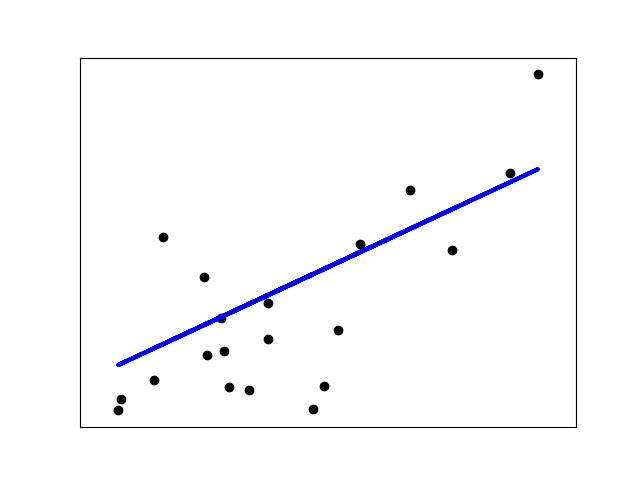

# Linear Classifiers and Logistic Regression
##----手把手教线性分类器和逻辑回归


## 线性分类
线性分类问题是数据在空间中的分布，可以用一条直线（或平面/超平面）分割。如螺旋状的数据线性不可分。  
线性分类器是一些可以解决线性分类问题的机器学习算法，其模型往往都是一个线性函数，如决策树桩/线性回归/支持向量机。  

线性回归和逻辑回归是数据挖掘领域最简单最基础的机器学习算法,几乎所有的机器学习书籍和教程都会将此算法放在最前面介绍，之后再逐渐深入。  

线性回归假设结果和特征满足线性关系，即![][1]  
[1]: http://latex.codecogs.com/gif.latex?h_{\Theta} \(x\)=\Theta{_0}+\Theta{_1}x_1+\Theta{_2}x_2+\Theta{_3}x_3  
，为连续模型，容易受噪声影响。

逻辑回归本质上是线性回归，只是在特征到结果的映射上添加一层函数映射，即  
![][2]  
[2]: http://latex.codecogs.com/gif.latex?z=h_{\Theta} \(x\)=\Theta{_0}+\Theta{_1}x_1+\Theta{_2}x_2+\Theta{_3}x_3  
，=\frac{1}{1+e^{-z}}) ，添加映射后，连续模型变为二元模型，受噪声影响变小。  

本文不对理论做过多介绍，有兴趣可参考 （[对线性回归、逻辑回归、各种回归的概念学习](http://blog.csdn.net/viewcode/article/details/8794401)）。下面在python环境下进行模型的演示。

### 一、安装python环境。     
可参考[python官网]（www.python.org），一般Linux都会自带python环境。  
### 二、安装sklearn包。  
简单的做法，可以先安装python的pip包管理工具，之后再用pip安装sklearn包。pip安装可参考（[http://pip.pypa.io](http://pip.pypa.io)），python 2版本2.7.9以上或python 3 版本3.4以上都自带pip，不再需要安装。  
####脚本安装方式：  
```
curl -O https://raw.github.com/pypa/pip/master/contrib/get-pip.py  
python get-pip.py
```

####包管理软件安装方式：
```
sudo yum install python-pip
sudo apt-get install python-pip
```
之后就可以用pip安装各类包了，本文中需要用到numpy，scipy，sklearn，matplotlib包。可使用pip install numpy scipy sklearn matplotlib安装。sklearn是python环境下的机器学习软件包，里面包含了常用的机器学习算法，用户只需使用自己的数据，调用其中相应的库，训练出自己的模型，再使用模型完成预测/分类等任务。

### 三、数据
线性回归：使用sklearn自带的糖尿病预测数据集。
糖尿病数据集包括442条记录，每条记录对应一个病人的生理数据，标签为一年以后的病情发展情况。数据集中特征维度为10维，包括年龄、性别、体质指数、血压、6种血清化验数据。

### 四、运用流程
导入数据:  
```
from sklearn import datasets
diabetes = dataset.load_diabetes()
```
查看数据概要:  
```
print diabets.data,diabets.target[0:10]   
```
分解特征和标签:  
```
import numpy as np
diabets_X = diabetes.data[:,np.newaxis,2]
diabets_y = diabetes.target
```
切分数据为训练集、测试集：  
```
diabets_X_train = diabetes_X[:-20]
diabets_y_train =diabetes_y[:-20]

diabets_X_test = diabetes_X[-20:]
diabets_y_test = diabetes_y[-20:]
```
建立模型：  
```
from sklearn import linear_model
lr = linear_model.LinearRegression()
```
训练模型：  
```
lr.fit(diabetes_X_train,diabetes_y_train)
```
使用训练出的模型进行预测：  
```
diabets_y_test_pred = lr.predict(diabetes_X_test)
```
查看预测效果，预测值与真值的均方误差（越小越好）：  
```
from sklearn.metrics import mean_squared_error
mse = mean_squared_error(diabetes_y_test,diabetes_y_test_pred)
print("Mean squared error: %.2f" %mse)
```
绘制示意图：  
```
import matplotlib.pyplot as plt
plt.scatter(diabetes_X_test,diabetes_y_test, color='black')
plt.plot(diabetes_X_test,diabetes_y_test_pred,color = 'blue',linewidth=3)
plt.show()
```


参考资料：http://blog.csdn.net/olanlanxiari/article/details/48086917


